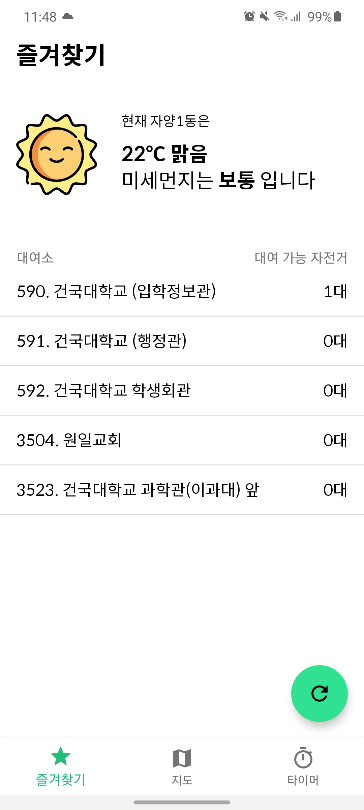
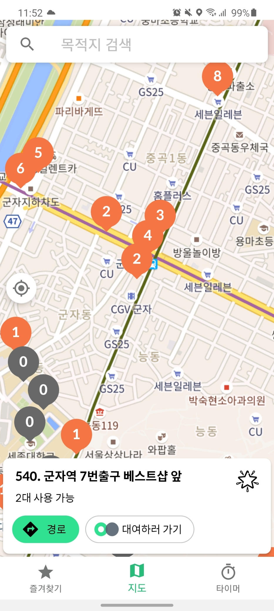
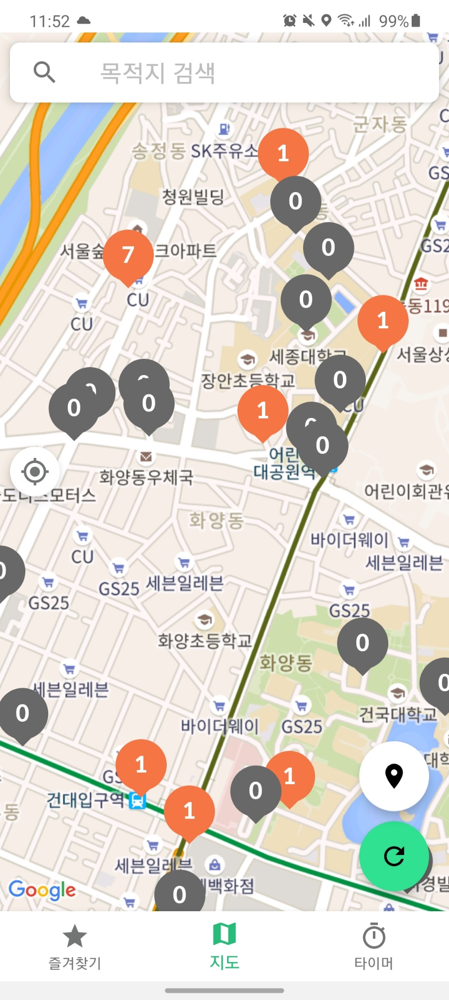
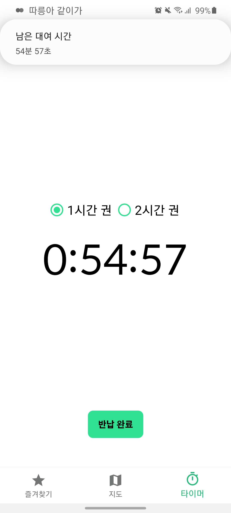

# 따릉아 같이가
 공식 따릉이 어플리케이션의 UI/UX, 속도 개선, 편의성을 증대시킬 부가적인 정보를 제공해주는 어플리케이션 입니다.
 [2019년 스마트 서울 모바일 앱 공모전 장려상](https://www.seoulappcontest.org/web/info/currentWinnerView.do?idx=104&year=2019&type=win)

## Introduction
1. 대여소 기반 길 찾기 - 목적지에서 가장 가까운 따릉이 대여소를 경유하는 자전거 길 찾기 기능 (네이버 지도 연동)

2. 즐겨 찾는 대여소 - 대여 가능 자전거 현황 표시

3. 날씨/미세 먼지 정보

4. 지도 ui - 대여 가능 자전거 수 마커 표시

5. 공원 정보 제공

6. 대여 잔여 시간 타이머

## Screenshot
</img>
</img>
</img>
</img>

---
## Libraries and APIs
### Libraries
- okhttp3
- [fab-speed-dial](https://github.com/yavski/fab-speed-dial)
- androidx
  
### APIs
- 서울시 공공데이터 - [미세먼지](https://data.seoul.go.kr/dataList/OA-2219/S/1/datasetView.do), [공원](https://data.seoul.go.kr/dataList/OA-394/S/1/datasetView.do)
- [기상청 공공데이터](https://www.weather.go.kr/weather/lifenindustry/sevice_rss.jsp)
- Google Map

## Application Versions
- minSdkVersion: 23
- targetSdkVersion: 29

## Setup
1. Clone or download this repo.
2. Put your google map api key at *google_maps_key* in [string.xml](https://github.com/honghyk/Ddareungi3.0/app\src\main\res\values\strings.xml) file
